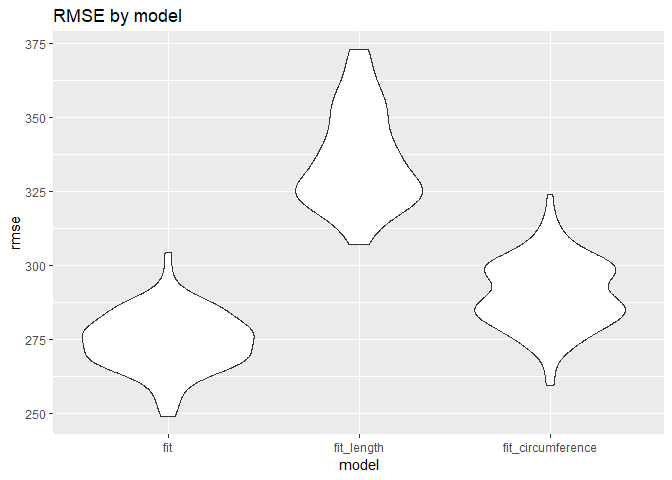

HW6\_ntk2109\_Markdown
================
Noah Kreski
November 20, 2018

### Problem One: Homicide Regression

``` r
 #I am creating city_state, eliminating data errors and unnecessary city-states, convert age to numeric, and applying a true/false statement to non-unknown race
Washington_data = read_csv("./data/WashingtonPost/homicide-data.csv")%>%
                  mutate(city_state = paste(city,state, sep = ","))%>%
                  filter(city_state != "Tulsa,AL")%>%
                  filter(!(city_state %in% c("Dallas,TX", "Phoenix,AZ", "Kansas City,MO")))%>%
                  mutate(victim_age = as.numeric(victim_age))%>%
                  filter((victim_race != "Unknown"))%>%
                  mutate(victim_race = as.numeric(victim_race == "White"))
#I am assigning white and non-white labels to race and numeric values to whether a case was resolved, while also making white the reference                  
Washington_data$victim_race <- factor(Washington_data$victim_race, levels = c(1,0), labels = c("White","Non-White"))
Washington_data$Solved <- as.numeric(Washington_data$disposition == "Closed by arrest")
Washington_data$victim_race = fct_relevel(Washington_data$victim_race, "White")
```

The above tidying prepares the data for regression analysis solved vs unresolved as the outcome and victim age, sex and race as predictors.

``` r
#I am modeling the solved outcome for Baltimore logistically.
fit_logistic = 
  Washington_data%>% 
  filter(city_state == "Baltimore,MD")%>%
  glm(Solved ~ victim_age + victim_race + victim_sex, data = ., family = binomial()) 
#I am getting the standard error for the regression coefficient of race
Race_se = (coef(summary(fit_logistic))[3, 2])
          
#I am tidying the data to get what I need, and creating a 95% confidence interval with the standard error attained earlier.
  fit_logistic %>%
  broom::tidy() %>% 
  mutate(OR = exp(estimate)) %>%
  mutate(conf_lower = exp(estimate - 1.96 * Race_se))%>%
  mutate(conf_higher = exp(estimate + 1.96 * Race_se))%>%
  select(term, log_OR = estimate, OR, conf_lower, conf_higher)%>%
  filter(term == "victim_raceNon-White")
```

    ## # A tibble: 1 x 5
    ##   term                 log_OR    OR conf_lower conf_higher
    ##   <chr>                 <dbl> <dbl>      <dbl>       <dbl>
    ## 1 victim_raceNon-White -0.820 0.441      0.313       0.620

The odds ratio for solving homicides comparing non-white victims to white victims, controlling for age and sex, in Baltimore, Md is .440608, with a 95% confidence interval of (.3129079, .6204234).

``` r
odds_function = function(x) {
  
  #I am modeling the solved outcome for every city logistically.
fit_logistic = 
  Washington_data%>% 
  filter(city_state == x)%>%
  glm(Solved ~ victim_age + victim_race + victim_sex, data = ., family = binomial()) 
#I am getting the standard error for the regression coefficient of race
Race_se = (coef(summary(fit_logistic))[3, 2])
          
#I am tidying the data to get what I need, and creating a 95% confidence interval with the standard error attained earlier.
  fit_logistic %>%
  broom::tidy() %>% 
  mutate(OR = exp(estimate)) %>%
  mutate(conf_lower = exp(estimate - 1.96 * Race_se))%>%
  mutate(conf_higher = exp(estimate + 1.96 * Race_se))%>%
  select(term, log_OR = estimate, OR, conf_lower, conf_higher)%>%
  filter(term == "victim_raceNon-White")
}
#This code will iterate the function over all cities, produce a column with tibbles, and unnest to generate proportions and CIs for every city.
city_list = c(unique(Washington_data$city_state))
city_df = tibble(city_list,
map(city_list, odds_function)) %>%
unnest()

city_df
```

    ## # A tibble: 47 x 6
    ##    city_list      term                  log_OR    OR conf_lower conf_higher
    ##    <chr>          <chr>                  <dbl> <dbl>      <dbl>       <dbl>
    ##  1 Albuquerque,NM victim_raceNon-White -0.302  0.739     0.447        1.22 
    ##  2 Atlanta,GA     victim_raceNon-White -0.284  0.753     0.432        1.31 
    ##  3 Baltimore,MD   victim_raceNon-White -0.820  0.441     0.313        0.620
    ##  4 Baton Rouge,LA victim_raceNon-White -0.404  0.668     0.313        1.43 
    ##  5 Birmingham,AL  victim_raceNon-White  0.0385 1.04      0.615        1.76 
    ##  6 Boston,MA      victim_raceNon-White -2.15   0.116     0.0480       0.282
    ##  7 Buffalo,NY     victim_raceNon-White -0.936  0.392     0.214        0.719
    ##  8 Charlotte,NC   victim_raceNon-White -0.584  0.558     0.321        0.969
    ##  9 Chicago,IL     victim_raceNon-White -0.576  0.562     0.431        0.733
    ## 10 Cincinnati,OH  victim_raceNon-White -1.14   0.318     0.184        0.551
    ## # ... with 37 more rows

The above data frame provides the odds ratios for solving homicides comparing non-white to white victims, both as a log estimate and the odds ratio, with confidence intervals.

``` r
city_df%>%
mutate(city_list = forcats::fct_reorder(city_list, OR))%>%
#I am creating a visual with proportions by location, with error bars, and formatting appropriately.
ggplot( aes(x = city_list, y = OR, group = city_list)) + geom_point() +theme(axis.text.x = element_text(angle = 70, hjust = 1)) + geom_errorbar( mapping=aes(x=city_list, ymin=conf_lower, ymax=conf_higher))+labs(title = "ORs for Solved Homicides, NonWhite vs White Victim, Adjusted by Sex/Age", x = "Location", y = "Odds Ratio")
```


This plot shows the adjusted odds ratios comparing Nonwhite to White homicide victims in terms of their homicides being solved. Overwhelmingly, Non-White victims were less likely to have their homicides solved than White victims, and approximately half of these odds ratios had a confidence interval that did not contain the null value, an odds ratio of 1.00. This provides consistent evidence of disparities in this outcome.

### Problem Two: Child Birthweight Models

To begin, I will conduct a backwards regression on the full set of variables. While this may be less thorough than other methods in isolation, it is only to supply a reasonable subset of variables that are critical to the outcome in question, which will then be honed with theory and conceptual edits.

``` r
#I am getting the data with appropriate formats
birthweight_data = read_csv("./data/birthweight.csv")%>%
                   mutate(babysex = as.factor(babysex), frace = as.factor(frace), malform = as.factor(malform), mrace = as.factor(mrace))
 #I am using a backwards selection model, eliminating one of the full set of predictors based on whatever has the highest p value until all are below .05                 
birthweight_data %>% 
  lm(bwt ~ babysex + bhead + blength + delwt + fincome + frace + gaweeks + malform + menarche + mheight + mrace + momage +parity + pnumlbw + pnumsga +ppbmi + ppwt + smoken + wtgain, data = .) %>% 
  broom::tidy() %>% 
  knitr::kable(digits = 3)
#Eliminated frace, all levels above .05
birthweight_data %>% 
  lm(bwt ~ babysex + bhead + blength + delwt + fincome + gaweeks + malform + menarche + mheight + mrace + momage +parity + pnumlbw + pnumsga +ppbmi + ppwt + smoken + wtgain, data = .) %>% 
  broom::tidy() %>% 
  knitr::kable(digits = 3)
#Eliminated malform, p = .889
birthweight_data %>% 
  lm(bwt ~ babysex + bhead + blength + delwt + fincome + gaweeks + menarche + mheight + mrace + momage +parity + pnumlbw + pnumsga +ppbmi + ppwt + smoken + wtgain, data = .) %>% 
  broom::tidy() %>% 
  knitr::kable(digits = 3)
#Eliminated ppbmi, p = .760
birthweight_data %>% 
  lm(bwt ~ babysex + bhead + blength + delwt + fincome + gaweeks + menarche + mheight + mrace + momage +parity + pnumlbw + pnumsga + ppwt + smoken + wtgain, data = .) %>% 
  broom::tidy() %>% 
  knitr::kable(digits = 3)
#Eliminated momage, p = .530
birthweight_data %>% 
  lm(bwt ~ babysex + bhead + blength + delwt + fincome + gaweeks + menarche + mheight + mrace +parity + pnumlbw + pnumsga + ppwt + smoken + wtgain, data = .) %>% 
  broom::tidy() %>% 
  knitr::kable(digits = 3)
#Eliminated menarche, p = .245
birthweight_data %>% 
  lm(bwt ~ babysex + bhead + blength + delwt + fincome + gaweeks + mheight + mrace +parity + pnumlbw + pnumsga + ppwt + smoken + wtgain, data = .) %>% 
  broom::tidy() %>% 
  knitr::kable(digits = 3)
#Eliminated fincome, p = .069
birthweight_data %>% 
  lm(bwt ~ babysex + bhead + blength + delwt + gaweeks + mheight + mrace +parity + pnumlbw + pnumsga + ppwt + smoken + wtgain, data = .) %>% 
  broom::tidy() %>% 
  knitr::kable(digits = 3)
#All variables p<.05 or multiple levels p<.05
```

Following data loading and tidying, creating factors where necessary, I used a backwards selection model to attain a final regression model for these data. Every step I took away to predictor with the highest p-value until all variables had a p&lt;.05, or multiple factor levels below that threshold. This final model has 13 predictors including baby sex, head circumference at birth in cm, length at birth in cm, mother's weight at delivery in pounds, gestational age in weeks, mother's height, mother's race, number of live births prior to this pregnancy, previous number of low birth weight babies, number of prior small for gestational age babies, mother's pre-pregnancy weight, average number of cigarettes smoked per day during pregnancy and weight gain during pregnancy.

However, it is worth asking conceptually what may be missing from this model. Prior research has shown that there may be an interaction between a baby's sex and growth timeline \[see citation below\], and so an interaction term between sex amd gestational age is a potentially worthwhile addition to this model.

Citation : Broere-Brown, Z. A., Baan, E., Schalekamp-Timmermans, S., Verburg, B. O., Jaddoe, V. W., & Steegers, E. A. (2016). Sex-specific differences in fetal and infant growth patterns: a prospective population-based cohort study. Biology of sex differences, 7, 65. <doi:10.1186/s13293-016-0119-1>

Additionally, a smaller gestational age may be more of a concern for low birth weight in mothers with a higher number of prior "small for gestational age" births, and so an interaction term between gaweeks and pnumsga is warranted.

``` r
#I'm creating the needed data set again in a chunk where eval does not equal False
birthweight_data = read_csv("./data/birthweight.csv")%>%
                   mutate(babysex = as.factor(babysex), frace = as.factor(frace), malform = as.factor(malform), mrace = as.factor(mrace))
#I'm assigning my final model to fit
fit = lm(bwt ~ babysex + blength + bhead + delwt + gaweeks + mheight + mrace +parity + pnumlbw + pnumsga + ppwt + smoken + wtgain + babysex*gaweeks + gaweeks*pnumsga, data = birthweight_data)
#I am plotting the predictions and residuals
birthweight_data%>%
  modelr::add_predictions(fit)%>%
  modelr::add_residuals(fit)%>%
  ggplot(aes(x=pred, y = resid)) + geom_point() + labs(title = "Residuals vs Predicted values: Backwards Selection model")
```


The residuals appear to exhibit consistent behavior across predicted values, centralized at a value of 0 and evenly distributed above and below, with the majority of residuals at an absolute value of 500 or less.

``` r
#I'm fitting the first alternative model and mapping its predictions and residuals.
fit_length_age = lm(bwt ~ blength + gaweeks, data = birthweight_data)

birthweight_data%>%
  modelr::add_predictions(fit_length_age)%>%
  modelr::add_residuals(fit_length_age)%>%
  ggplot(aes(x=pred, y = resid)) + geom_point() + labs(title = "Residuals vs Predicted values: Length and Age")
```


``` r
#I'm fitting the second alternative model and mapping its predictions and residuals.
fit_circumference_length_sex = lm (bwt ~ bhead + blength + babysex + bhead*blength + bhead*babysex + blength*babysex + bhead*blength*babysex, data = birthweight_data)

birthweight_data%>%
  modelr::add_predictions(fit_circumference_length_sex)%>%
  modelr::add_residuals(fit_circumference_length_sex)%>%
  ggplot(aes(x=pred, y = resid)) + geom_point() + labs(title = "Residuals vs Predicted values: Circumference, Length and Sex")
```


These plots map the residuals and predicted values for the two alternative models in the same way that I did earlier for my own model. The model with just length and age has much larger residuals, often close to 1,000, whereas the model with sex, head circumference and length appears similar to my own model.

``` r
#I am developing test and train subsets for cross-validation
cv_df = crossv_mc(birthweight_data, 100) 

cv_df %>% pull(train) %>% .[[1]] %>% as_tibble
```

    ## # A tibble: 3,473 x 20
    ##    babysex bhead blength   bwt delwt fincome frace gaweeks malform menarche
    ##    <fct>   <int>   <int> <int> <int>   <int> <fct>   <dbl> <fct>      <int>
    ##  1 2          34      51  3629   177      35 1        39.9 0             13
    ##  2 1          34      48  3062   156      65 2        25.9 0             14
    ##  3 2          36      50  3345   148      85 1        39.9 0             12
    ##  4 1          34      52  3062   157      55 1        40   0             14
    ##  5 2          34      52  3374   156       5 1        41.6 0             13
    ##  6 1          33      52  3374   129      55 1        40.7 0             12
    ##  7 2          33      46  2523   126      96 2        40.3 0             14
    ##  8 1          33      50  3459   169      75 2        40.7 0             12
    ##  9 2          35      51  3317   130      55 1        43.4 0             13
    ## 10 1          35      51  3459   146      55 1        39.4 0             12
    ## # ... with 3,463 more rows, and 10 more variables: mheight <int>,
    ## #   momage <int>, mrace <fct>, parity <int>, pnumlbw <int>, pnumsga <int>,
    ## #   ppbmi <dbl>, ppwt <int>, smoken <dbl>, wtgain <int>

``` r
cv_df %>% pull(test) %>% .[[1]] %>% as_tibble
```

    ## # A tibble: 869 x 20
    ##    babysex bhead blength   bwt delwt fincome frace gaweeks malform menarche
    ##    <fct>   <int>   <int> <int> <int>   <int> <fct>   <dbl> <fct>      <int>
    ##  1 2          33      49  2778   140       5 1        37.4 0             12
    ##  2 1          36      52  3515   146      85 1        40.3 0             11
    ##  3 1          35      51  3544   129      65 1        39.6 0             12
    ##  4 2          35      57  3374   147      45 1        39.6 0             12
    ##  5 1          34      52  3203   134      25 1        41.1 0             14
    ##  6 2          34      52  3629   112      25 1        38   0             10
    ##  7 1          36      54  3402   161      95 1        40.1 0             11
    ##  8 2          33      54  3062   134      65 1        40.4 0             12
    ##  9 1          35      55  3856   171      85 1        41.1 0             13
    ## 10 1          35      53  3175   130      45 1        40.4 0             13
    ## # ... with 859 more rows, and 10 more variables: mheight <int>,
    ## #   momage <int>, mrace <fct>, parity <int>, pnumlbw <int>, pnumsga <int>,
    ## #   ppbmi <dbl>, ppwt <int>, smoken <dbl>, wtgain <int>

``` r
cv_df =
  cv_df %>% 
  mutate(train = map(train, as_tibble),
         test = map(test, as_tibble))
#I am using my various models in cross-validation examining each model with the train set, and then examining RMSE with the test set
cv_df = 
  cv_df %>% 
  mutate( fit = map(train, ~lm(bwt ~ babysex + blength + bhead +  delwt + gaweeks + mheight + mrace +parity + pnumlbw + pnumsga + ppwt + smoken + wtgain + babysex*gaweeks + gaweeks*pnumsga, data = .x)),
         fit_length_age = map(train, ~lm(bwt ~ blength + gaweeks, data = .x)),
         fit_circumference_length_sex = map(train, ~lm(bwt ~ bhead + blength + babysex + bhead*blength + bhead*babysex + blength*babysex + bhead*blength*babysex, data = .x))) %>% 
  mutate(rmse_fit    = map2_dbl(fit, test, ~rmse(model = .x, data = .y)),
         rmse_fit_length = map2_dbl(fit_length_age, test, ~rmse(model = .x, data = .y)),
         rmse_fit_circumference = map2_dbl(fit_circumference_length_sex, test, ~rmse(model = .x, data = .y)))
#I am visualizing the RMSE distributions for each model.
cv_df %>% 
  select(starts_with("rmse")) %>% 
  gather(key = model, value = rmse) %>% 
  mutate(model = str_replace(model, "rmse_", ""),
         model = fct_inorder(model)) %>% 
  ggplot(aes(x = model, y = rmse)) + geom_violin() + labs(title = "RMSE by model")
```



The above cross validation and RMSE visual shows a lower RMSE for my own model than for either of the two alternative models provides, evidenced by a distribution of RMSE values that is lower than either of the other models.
